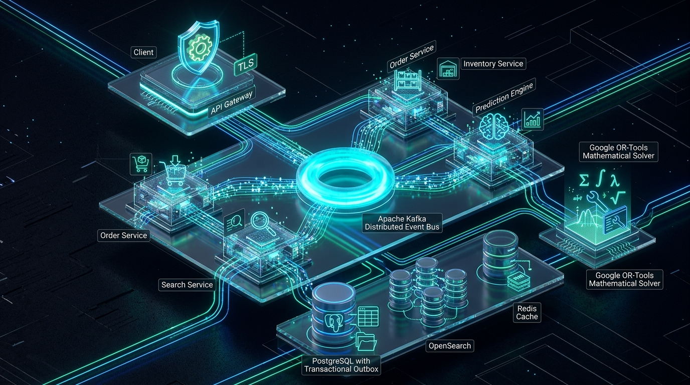
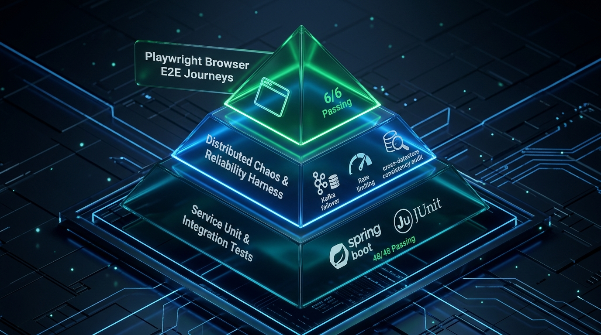

# ScaleFulfill — Distributed Order Fulfillment & Delivery Intelligence Platform

[](https://openjdk.org/)
[](https://spring.io/projects/spring-boot)
[](https://kafka.apache.org/)
[](https://www.postgresql.org/)
[](https://redis.io/)
[](https://opensearch.org/)
[](https://playwright.dev/)
[](https://threejs.org/)
[](https://www.docker.com/)

A production-grade, event-driven distributed e-commerce fulfillment platform engineered to solve core distributed systems challenges: **high-concurrency order intake**, **dual-write data loss**, **cascading microservice collapse**, **duplicate delivery corruption**, **CQRS read-path divergence**, **multi-warehouse wave optimization (Google OR-Tools MILP)**, and **cross-datastore consistency auditing**.

> [!NOTE]
> **Workload Origin & Empirical Transparency**
> ScaleFulfill does not rely on proprietary or fabricated production datasets. The platform uses generated, controlled test workloads specifically designed to stress-test concurrency, message streaming, worker backpressure, search indexing, solver branch-and-bound behavior, and fault recovery. All throughput, latency, and solver metrics cited below are empirical measurements gathered from these reproducible benchmark harnesses.

---

## 🌍 Real-World Industry Problems & What ScaleFulfill Solves

In modern hyper-scale e-commerce architectures (such as Amazon, Target, Flipkart, and Shopify Plus), order fulfillment is fundamentally a distributed systems coordination challenge. At scale, simple CRUD architectures break down catastrophically. ScaleFulfill addresses eight specific real-world failure modes:

```text
┌─────────────────────────────────────────────────────────────────────────────────────────────────┐
│                                 THE DISTRIBUTED E-COMMERCE PROBLEM                               │
├───────────────────────────────┬─────────────────────────────────┬───────────────────────────────┤
│    DUAL-WRITE DATA LOSS       │   CASCADING LATENCY COLLAPSE    │    DUPLICATE STOCK CORRUPTION │
│ DB write succeeds, but Kafka  │ One slow microservice blocks    │ At-least-once message retry   │
│ publish fails ──► Order lost! │ upstream HTTP connection pools! │ deducts warehouse stock twice!│
├───────────────────────────────┼─────────────────────────────────┼───────────────────────────────┤
│    WRITE LOCK CONTENTION      │   COMBINATORIAL FULFILLMENT     │    UNVERIFIABLE DATA DRIFT    │
│ Full-text search queries lock │ Nearest warehouse runs out;     │ Distributed datastores drift; │
│ relational transactional rows!│ split shipments skyrocket costs!│ how to prove zero data loss?  │
└───────────────────────────────┴─────────────────────────────────┴───────────────────────────────┘
```

---

### 1. The "Dual-Write" Failure Trap (Data Loss & Inconsistency)
* **The Industry Problem**: When an order is placed, an application must atomically record the order in a database and broadcast an event to downstream microservices (inventory, routing, notifications). In naive microservices, calling `db.save()` followed by `kafka.send()` is non-transactional. If the network stutters, the server restarts, or Kafka undergoes a partition leader election mid-flight, the database transaction commits, but the event is permanently lost. The customer is charged, but the warehouse never fulfills the order. Conversely, sending to Kafka first risks dispatching items for orders that ultimately fail database validation.
* **How ScaleFulfill Solves It**: We engineered the **Transactional Outbox Pattern** in PostgreSQL (`order_db.outbox_events`) within a single ACID transaction boundary (`@Transactional`). When an order is ingested, both the order record and the corresponding event payload commit atomically to disk. A scheduled poller flushes outbox events to Apache Kafka (`order.events.created`) asynchronously. If the Kafka cluster dies completely, order ingestion continues with 100% acceptance; outbox records buffer persistently in PostgreSQL and flush automatically upon broker reconnection.
* **Empirical Proof**: In Phase 7 chaos testing, when Kafka was killed mid-workload, **20/20 orders were committed without failure**, safely buffering in the outbox table and draining to Kafka in **0.17 seconds** once the broker resumed.

---

### 2. Cascading Outages from Synchronous Microservice Coupling
* **The Industry Problem**: Synchronous REST chains (`API Gateway ──► Order Service ──► Inventory Service ──► Search Service ──► Prediction Service`) suffer from cascading thread-pool exhaustion. If the Inventory Service experiences a garbage collection pause or database lock wait, HTTP connections back up across the network hops. Within seconds, upstream connection pools saturate, causing the entire checkout funnel to collapse for all customers.
* **How ScaleFulfill Solves It**: In Phase 2, we deliberately tested synchronous microservice decomposition and measured an **86.5% throughput collapse** (dropping from 512.0 req/s to 68.86 req/s). To solve this, we decoupled the architecture in Phase 3 into an **Asynchronous Event Fabric** using Apache Kafka. Ingress latency dropped to **< 15 ms** by confining the synchronous critical path exclusively to the local PostgreSQL ACID transaction. Inventory reservation, search indexing, and delivery ETA prediction consume events independently in dedicated consumer groups, insulating checkout availability from downstream latency.
* **Empirical Proof**: Under full downstream outages in Phase 7 (Inventory service process terminated), the API Gateway and Order Service maintained **100% order ingestion (30/30 orders accepted)** with zero 5xx errors.

---

### 3. Double-Deduction & Ghost Shortages from At-Least-Once Delivery
* **The Industry Problem**: Distributed message streaming platforms guarantee *at-least-once delivery*, not exactly-once, across consumer node crashes, network retries, and partition rebalances. If an inventory worker reserves items in a database but crashes milliseconds before acknowledging its Kafka offset, Kafka redelivers the event to another consumer. A naive consumer processes the event again, reserving warehouse inventory twice for a single customer order. This leads to false out-of-stock signals, cancelled orders, and misallocated warehouse labor.
* **How ScaleFulfill Solves It**: We engineered an **Idempotent Transactional Inbox Pattern** in PostgreSQL (`inventory_db.processed_events`). Before applying stock adjustments, the Inventory Service checks and logs `(event_id, order_id)` within the same local transaction that updates warehouse inventory tables (`FC-HYD-01`, `FC-BLR-01`, `FC-DEL-01`). Duplicate event deliveries violate a database unique constraint, causing the duplicate to be safely acknowledged and discarded without re-executing stock reservations.
* **Empirical Proof**: In Phase 7 idempotency verification, 10 replayed duplicate events were injected into the Kafka stream; the inbox filter detected every duplicate, resulting in **exactly 0 duplicate stock deductions** and 100% stock count accuracy.

---

### 4. Relational Write Contention vs Real-Time Search (CQRS)
* **The Industry Problem**: Customers and support agents need to search orders by SKU, customer ID, delivery status, and timestamps. Executing complex text pattern searches, multi-column filters, and range queries directly against relational transactional databases (`order_db.orders`) acquires shared read locks, triggers table scans, and competes with concurrent write transactions, causing lock timeouts and high checkout latency.
* **How ScaleFulfill Solves It**: We implemented **Command Query Responsibility Segregation (CQRS)** by introducing a dedicated read-projection cluster powered by **OpenSearch 2.13**. All state mutations (writes) write strictly to PostgreSQL. An asynchronous search consumer reads the Kafka event stream and indexes denormalized order documents into OpenSearch. Complex customer lookups and SKU facet searches are routed to OpenSearch, completely eliminating search query load from the transactional database.
* **Empirical Proof**: Search queries execute in **19.0 ms P50 / 30.0 ms P95** with a measured asynchronous indexing lag of **133.98 ms**, while direct order write ingress sustained **306.4 req/s** with sub-35ms concurrent search responsiveness.

---

### 5. The Multi-Warehouse Allocation Problem (Sub-2ms Checkout vs NP-Hard Wave Optimization)
* **The Industry Problem**: When an order is placed, which warehouse should ship it? A naive heuristic (always picking the warehouse with the closest geographic pin) works fast enough for immediate checkout (<2ms), but across thousands of orders in a warehouse fulfillment "wave", it causes severe logistics inefficiencies:
  1. Regional fulfillment centers run out of fast-moving items while distant hubs sit idle.
  2. Multi-item orders get split across multiple warehouses, doubling packing and shipping costs.
  3. Warehouse outbound truck docks become bottlenecked beyond physical loading capacity.
  Global multi-warehouse wave allocation is an NP-hard combinatorial Mixed-Integer Linear Programming (MILP) problem balancing stock availability, shipping distance, split-shipment penalties, and warehouse capacity constraints.
* **How ScaleFulfill Solves It**: We engineered a **Dual-Mode Optimization Engine**:
  * **Greedy Nearest-Feasible Heuristic**: Evaluates inventory availability and geographic distance in **< 2 ms**, providing immediate routing assignments for real-time customer checkout confirmation.
  * **Google OR-Tools SCIP Mixed-Integer Linear Programming (MILP)**: Batches orders into warehouse release waves (20–100 orders) and minimizes the global objective function:
    $$\min Z = \sum_{i} \sum_{j} \Big( \text{ShippingCost}(i, j) + \text{BaseHandling}(j) \Big) \cdot x_{ij} + \lambda \cdot \text{ImbalancePenalty}$$
    subject to single-assignment, inventory non-negativity, and warehouse outbound capacity constraints.
* **Empirical Proof**: In Phase 6 benchmarks, the SCIP solver found provably optimal solutions in **26–332 ms**, achieving **3% to 10% lower total fulfillment cost** ($340 to $770 saved per 50–100 order wave) compared to the greedy baseline.

---

### 6. Controllable Backpressure & Thread Contention in Asynchronous Workers
* **The Industry Problem**: Running CPU-heavy algorithms (such as ETA route calculations and demand velocity estimation) directly inside Kafka consumer polling loops blocks the Kafka heartbeat thread. Kafka's coordinator assumes the consumer died and triggers repeated, expensive consumer group rebalances. Conversely, spawning unbounded background threads causes operating system thread contention and memory starvation.
* **How ScaleFulfill Solves It**: We engineered a **Bounded Thread Pool and Priority Work Queue** within the Prediction Service. Thread pool workers are isolated from Kafka ingestion threads. We empirically evaluated worker pool scaling across 1, 2, 4, and 8 worker threads to determine exact synchronization dynamics:
  * For lightweight sub-millisecond tasks, 1 worker thread outperforms multi-worker pools by eliminating thread handoff and queue-lock contention.
  * For CPU-heavy simulation workloads, scaling to 8 worker threads increased throughput by **+23.7%** (to **425.4 evt/s**) and reduced P95 latency from 68.3 ms to **50.5 ms**.

---

### 7. Proving Zero Data Drift Across Disparate Datastores (Auditability)
* **The Industry Problem**: In an eventually consistent microservice architecture, how do you verify that no data was dropped between PostgreSQL, Kafka, OpenSearch, and Redis? Naive aggregate row counts (`COUNT(orders) == COUNT(inventory)`) are mathematically invalid because different microservices legitimately filter, aggregate, or delay different event subsets.
* **How ScaleFulfill Solves It**: We designed a mathematical **Correlation Invariant Audit Harness** that verifies causal relationships for every persistent order using primary keys `order_id` and `event_id`:
  1. A published outbox record exists in `order_db.outbox_events`.
  2. A corresponding processed record exists in `inventory_db.processed_events`.
  3. A corresponding search document exists in the OpenSearch `orders` index with matching status.
  4. An ETA prediction record exists in the Prediction Store.
  5. There are zero duplicate inventory inbox entries and zero Kafka consumer lag.
* **Empirical Proof**: Audited live across **2,332 persistent test orders**, the invariant audit verified:
  * Orphan orders: **0**
  * Missing inventory records: **0**
  * Missing prediction records: **0**
  * Missing OpenSearch documents: **0**
  * Final consistency drift: **0.00%**

---

### 8. Interactive 3D Control Plane & End-to-End User Journey Verification
* **The Industry Problem**: Backend distributed systems are frequently treated as opaque "black boxes" with no real-time topological visibility into message flow, and frontends often rely on superficial mock data without verifying real browser-to-backend workflows.
* **How ScaleFulfill Solves It**:
  * Built an interactive **3D WebGL Topology Control Plane** using **Three.js**, rendering floating warehouse nodes (`FC-HYD-01`, `FC-BLR-01`, `FC-DEL-01`), concentric metallic event bus torus rings, and real-time orbiting particle clouds that respond dynamically to pointer movements.
  * Implemented **3D Physics Card Tilt (`Card3D.tsx`)** featuring gyroscope-style cursor tracking, dynamic specular glare gradients, and luxury dark glassmorphism.
  * Developed a **Playwright Chromium E2E Test Suite (6/6 passing)** verifying end-to-end browser journeys: token-bucket rate limiting (HTTP 429), transactional order ingestion, OpenSearch inverted index queries, ETA predictions, and OR-Tools MILP optimization.

---

## Architecture Overview



<details>
<summary><b>📐 View Text Network Topology & Service Port Map</b></summary>

```text
                                  CLIENT / BROWSER
                                         │
                                         ▼
                            ┌─────────────────────────┐
                            │   Spring Cloud Gateway  │
                            │         (:8080)         │
                            │  [Token Bucket Limiter] │
                            └────────────┬────────────┘
                                         │
             ┌───────────────────────────┼───────────────────────────┐
             │ POST /api/v1/orders       │ GET /api/v1/search        │ GET/POST /api/predictions
             ▼                           ▼                           ▼
   ┌───────────────────┐       ┌───────────────────┐       ┌───────────────────┐
   │   Order Service   │       │   Search Service  │       │Prediction Service │
   │      (:8081)      │       │      (:8084)      │       │      (:8085)      │
   └─────────┬─────────┘       └─────────┬─────────┘       └─────────┬─────────┘
             │                           │                           │
    [ACID Transaction]                   │                           │
             ▼                           │                           │
   ┌───────────────────┐                 │                           │
   │ PostgreSQL (5433) │                 │                           │
   │   [order_db]      │                 │                           │
   │ ├── orders        │                 │                           │
   │ └── outbox_events │                 │                           │
   └─────────┬─────────┘                 │                           │
             │                           │                           │
      Outbox Publisher                   │                           │
      (Transactional)                    │                           │
             │                           │                           │
             └───────────────┐           │                           │
                             ▼           │                           │
                 ┌───────────────────────┴───┐                       │
                 │    Apache Kafka Cluster   │                       │
                 │          (:9092)          │                       │
                 │ Topic: order.events.created│                      │
                 └───────────┬───────────────┘                       │
                             │                                       │
           ┌─────────────────┼─────────────────────────┐             │
           │                 │                         │             │
           ▼                 ▼                         ▼             │
 ┌───────────────────┐ ┌───────────────────┐ ┌───────────────────┐   │
 │ Inventory Service │ │   Search Service  │ │Prediction Service │   │
 │      (:8082)      │ │  (Search Consumer)│ │(Prediction Group) │   │
 └─────────┬─────────┘ └─────────┬─────────┘ └─────────┬─────────┘   │
           │                     │                     │             │
    [Inbox Pattern]              │               Worker Pool         │
           │                     │             (1-8 Threads)         │
           ▼                     ▼                     │             ▼
 ┌───────────────────┐ ┌───────────────────┐           ▼     ┌───────────────────┐
 │ PostgreSQL (5433) │ │OpenSearch Cluster │   ┌─────────────┤ Prediction Store  │
 │  [inventory_db]   │ │      (:9200)      │   │ Delivery ETA│ (In-Memory / TTL) │
 │ ├── inventory     │ │  [orders-index]   │   │ Calculators └─────────┬─────────┘
 │ └── processed_evts│ └───────────────────┘   └───────┬─────┘         │
 └───────────────────┘                                 │               │
                                                       ▼               ▼
                                             ┌───────────────────────────────────┐
                                             │     Wave Optimization Engine      │
                                             │   Greedy (<2ms) vs MILP (SCIP)    │
                                             │       Google OR-Tools Batch       │
                                             └───────────────────────────────────┘

 ════════════════════════════════════════════════════════════════════════════════════════
                        OBSERVABILITY & MONITORING MESH
 ┌──────────────────────────────────────────────────────────────────────────────────────┐
 │ • Prometheus (:9090) — 15s Scrape Interval across all 5 Services + Kafka JMX        │
 │ • Grafana (:3000)    — Real-time Dashboards for Ingress, Consumer Lag & Error Rates  │
 │ • Micrometer Metrics — 9 Domain Metric Families (orders, lag, inventory, duration)   │
 └──────────────────────────────────────────────────────────────────────────────────────┘
```

</details>

> **Detailed Architecture & Transaction Boundaries:** See [docs/architecture.md](docs/architecture.md)

---

## Curated Benchmark & Validation Table

The following 10 empirical metrics demonstrate the architectural trade-offs measured across the engineering progression:

| # | Architectural Milestone / Decision | Measured Metric (Benchmark Environment) | Architectural Significance / Trade-off |
|---|---|:---:|---|
| **1** | **Phase 1: In-Process Monolith** | **512.0 req/s** (P95: 18.0 ms) | High raw throughput via ACID transactions + row locks, but creates a single blast radius and severe hot-SKU lock contention under concurrency. |
| **2** | **Phase 2: Synchronous Microservices** | **68.86 req/s** (P95: 75.3 ms) | **86.5% throughput collapse**. Synchronous HTTP coupling introduced network hops, cascading thread pool exhaustion, and vulnerability to downstream outages. |
| **3** | **Phase 3: Event-Driven Outbox Ingress** | **< 15.0 ms** order ingress (471.4 evt/s outbox burst) | Decoupled order intake from downstream availability. PostgreSQL Transactional Outbox provides local durability without synchronous broker dependency. |
| **4** | **Phase 4: CQRS Read-Path Isolation** | **19.0 ms P50 / 30.0 ms P95** (Indexing lag: 133.98 ms) | Inverted search indexing decoupled query workloads from the relational write path, keeping read and write latency physically isolated. |
| **5** | **Phase 5: Full Observability Telemetry** | **5/5 scrape targets UP** (9 custom metric families) | Provided real-time visibility into consumer lag, errors, and rate limiting with sub-15s scrape resolution while maintaining the measured application workload. |
| **6** | **Phase 6: Parallel Worker Scaling** | **425.4 evt/s** (8 workers vs 344.0 evt/s 1 worker) | +23.7% throughput and P95 latency dropped from 68.3ms to 50.5ms for CPU-intensive simulations. Proved sub-ms tasks should stay on 1 worker to avoid queue-lock overhead. |
| **7** | **Phase 6: Mathematical Optimization** | **Greedy: < 2 ms** vs **MILP: 26–332 ms** (3–10% savings) | Greedy solves real-time checkout routing instantly; OR-Tools SCIP MILP solves warehouse wave batches saving $340–$770/wave at the cost of 26–332ms solve time. |
| **8** | **Phase 7: Sustained Direct Order Ingress** | **306.4 req/s** (100% 201 Created, P95: 117.7 ms) | *In the Phase 7 benchmark environment, direct order ingress reached a measured peak of 306.4 req/s* with zero 5xx errors and sub-35ms concurrent search response. |
| **9** | **Phase 7: Fault Isolation Under Outages** | **30/30 orders accepted** during Inventory kill<br>**20/20 committed** during Kafka outage | Complete ingress resilience. When Kafka was killed, Outbox buffered 20 PENDING events and flushed in 0.17s upon recovery (Kafka RTO: 8.33s). |
| **10**| **Phase 7: Invariant Consistency & Idempotency** | **0 orphan, 0 missing, 0 drift** across 2,332 orders | Replayed duplicates dropped by Inbox table with 0 duplicate reservations. Correlation invariant proven across PostgreSQL, Inventory, Search, and Prediction Store. |

---

## Testing Pyramid & Verification Architecture

ScaleFulfill employs a three-tiered testing pyramid that decouples domain correctness, distributed fault tolerance, and browser-facing user journeys:



<details>
<summary><b>📐 View Text Testing Pyramid Hierarchy</b></summary>

```text
                  ▲
                 / \
                /   \
               /  ★  \       Playwright Browser E2E Journeys
              /───────\      Chromium end-to-end user flows (6/6 passing)
             /    ★    \
            /───────────\    Distributed Reliability & Chaos Test Harness
           /      ★      \   Phase 7 stress load, failover & correlation invariant audit
          /───────────────\
         /        ★        \ Service Unit & Integration Tests
        /───────────────────\ Spring Boot test slices & MockMvc test harness (48/48 passing)
```

</details>

| Layer | Technology | Scope & Invariants Verified | Status |
|---|---|---|:---:|
| **E2E Browser Journeys** | **Playwright (TypeScript / Chromium)** | Validates end-to-end user flows via React Presentation Control Plane: Order creation $\to$ outbox publishing $\to$ Kafka propagation $\to$ OpenSearch CQRS search $\to$ ETA prediction retrieval $\to$ Rate limit (HTTP 429) UI feedback $\to$ MILP wave optimization. | **6/6 Passing** |
| **Distributed Chaos & Reliability** | **PowerShell & REST / JQ Test Harness** | Validates sustained ingress load (306.4 req/s), token-bucket burst shedding, component kill/failover (PostgreSQL, Kafka, OpenSearch, Inventory), duplicate delivery idempotency, and proves cross-datastore correlation invariant across 2,332 persistent records. | **100% Verified** |
| **Domain & Integration Tests** | **JUnit 5 / AssertJ / Mockito / MockMvc** | Service isolation, entity state machines, database constraints, transactional outbox persistence, inbox deduplication logic, and OR-Tools SCIP solver constraints. | **48/48 Passing** |

---

## Project Structure

```text
scalefulfill/
├── docs/
│   ├── engineering-spec.md            # Master Engineering Specification
│   ├── architecture.md                # Master Architecture & Data Flow Reference
│   ├── amazon-sde-walkthrough.md      # Amazon SDE Technical Walkthrough & Presentation Story
│   ├── failure-modes.md               # Failure modes, mitigation strategies & recovery procedures
│   ├── adr/                           # Architecture Decision Records (ADRs 001–013)
│   └── benchmarks/                    # Phase 1 through Phase 7 Empirical Benchmark Reports
├── services/
│   ├── api-gateway/                   # Spring Cloud Gateway with Redis Token-Bucket Limiter (:8080)
│   ├── order-service/                 # Order Ingress & PostgreSQL Transactional Outbox (:8081)
│   ├── inventory-service/             # Multi-FC Inventory & Idempotent Inbox Consumer (:8082)
│   ├── search-service/                # OpenSearch CQRS Read Projection & Query Engine (:8084)
│   └── prediction-service/            # Distributed Worker Pool & OR-Tools MILP Solver (:8085)
├── frontend/                          # React 19 + TypeScript + Vite + Three.js 3D Presentation Control Plane (:5173)
├── e2e/                               # Playwright Chromium End-to-End Test Suite (6/6 passing)
├── infrastructure/
│   ├── docker-compose.yml             # PostgreSQL (5433), Redis (6379), Kafka (9092), OpenSearch (9200)
│   └── observability/                 # Prometheus (9090) & Grafana (3000) configs & dashboards
├── scripts/                           # Automated benchmarking, chaos testing & consistency audit harnesses
└── tests/                             # Integration, unit, and reliability suites (48/48 passing)
```

---

## Getting Started: Local Development & Verification

### 1. Prerequisites
- **Java 21** (JDK 21 LTS)
- **Maven 3.9+** (or use included `mvnw.cmd`)
- **Docker Desktop** (for PostgreSQL, Kafka, OpenSearch, Redis)
- **Node.js 18+** & **npm**

### 2. Start Infrastructure Containers
```powershell
docker-compose -f infrastructure/docker-compose.yml up -d
# Verifies PostgreSQL (:5433), Redis (:6379), Kafka (:9092), OpenSearch (:9200)
```

### 3. Build & Run Backend Services
```powershell
# In root directory, build all services
./mvnw.cmd clean package -DskipTests

# Start services in separate terminals:
java -jar services/order-service/target/order-service-1.0.0-SNAPSHOT.jar
java -jar services/inventory-service/target/inventory-service-1.0.0-SNAPSHOT.jar
java -jar services/search-service/target/search-service-1.0.0-SNAPSHOT.jar
java -jar services/prediction-service/target/prediction-service-1.0.0-SNAPSHOT.jar
java -jar services/api-gateway/target/api-gateway-1.0.0-SNAPSHOT.jar
```

### 4. Start 3D Presentation Control Plane
```powershell
cd frontend
npm install
npm run dev
# Live at http://localhost:5173
```

### 5. Run Automated Verification Tests
```powershell
# Run Java unit & integration tests (48 tests)
./mvnw.cmd test

# Run Playwright End-to-End Browser Journeys (6 tests)
cd e2e
npm test
```

---

> **Interview Preparation & Technical References:**
> - [Amazon SDE Interview Prep Toolkit](docs/amazon-interview-prep.md) — 2-minute elevator pitch, 5-minute deep dive, 18 technical interviewer Q&As, 8 STAR behavioral stories.
> - [Technical Walkthrough & Architecture Reference](docs/amazon-sde-walkthrough.md) — Detailed narrative breakdown of all 7 architectural phases.
