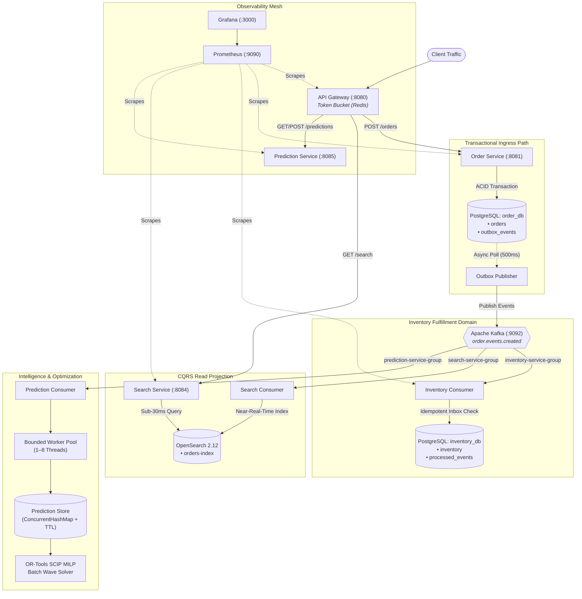

# ScaleFulfill Master Architecture Documentation
## Frozen Engineering Baseline (Phases 1–7)

---

## 1. Master System Topology

ScaleFulfill is a distributed, event-driven order fulfillment and delivery intelligence platform. The architecture separates the transactional write path from search projections and computational optimization workloads using Apache Kafka and the Transactional Outbox pattern.

```text
                                  CLIENT / CALLER
                                         │
                                         ▼
                            ┌─────────────────────────┐
                            │   Spring Cloud Gateway  │
                            │         (:8080)         │
                            │  [Token Bucket Limiter] │
                            └────────────┬────────────┘
                                         │
            ┌────────────────────────────┼────────────────────────────┐
            │ POST /api/v1/orders        │ GET /api/v1/search         │ GET/POST /api/predictions
            ▼                            ▼                            ▼
  ┌───────────────────┐        ┌───────────────────┐        ┌───────────────────┐
  │   Order Service   │        │   Search Service  │        │Prediction Service │
  │      (:8081)      │        │      (:8084)      │        │      (:8085)      │
  └─────────┬─────────┘        └─────────┬─────────┘        └─────────┬─────────┘
            │                            │                            │
   [ACID Transaction]                    │                            │
            ▼                            │                            │
  ┌───────────────────┐                  │                            │
  │ PostgreSQL (5433) │                  │                            │
  │   [order_db]      │                  │                            │
  │ ├── orders        │                  │                            │
  │ └── outbox_events │                  │                            │
  └─────────┬─────────┘                  │                            │
            │                            │                            │
     Outbox Publisher                    │                            │
     (Transactional)                     │                            │
            │                            │                            │
            └────────────────┐           │                            │
                             ▼           │                            │
                 ┌───────────────────────┴───┐                        │
                 │    Apache Kafka Cluster   │                        │
                 │          (:9092)          │                        │
                 │ Topic: order.events.created│                       │
                 └───────────┬───────────────┘                        │
                             │                                        │
           ┌─────────────────┼─────────────────────────┐              │
           │                 │                         │              │
           ▼                 ▼                         ▼              │
 ┌───────────────────┐ ┌───────────────────┐ ┌───────────────────┐    │
 │ Inventory Service │ │   Search Service  │ │Prediction Service │    │
 │      (:8082)      │ │  (Search Consumer)│ │(Prediction Group) │    │
 └─────────┬─────────┘ └─────────┬─────────┘ └─────────┬─────────┘    │
           │                     │                     │              │
    [Inbox Pattern]              │               Worker Pool          │
           │                     │             (1-8 Threads)          │
           ▼                     ▼                     │              ▼
 ┌───────────────────┐ ┌───────────────────┐           ▼     ┌───────────────────┐
 │ PostgreSQL (5433) │ │OpenSearch Cluster │   ┌───────────────┤ Prediction Store  │
 │  [inventory_db]   │ │      (:9200)      │   │ Delivery ETA  │ (In-Memory / TTL) │
 │ ├── inventory     │ │  [orders-index]   │   │  Calculators  └─────────┬─────────┘
 │ └── processed_evts│ └───────────────────┘   └───────┬───────┘         │
 └───────────────────┘                                 │                 │
                                                       ▼                 ▼
                                             ┌───────────────────────────────────┐
                                             │     Wave Optimization Engine      │
                                             │   Greedy (<2ms) vs MILP (SCIP)    │
                                             │       Google OR-Tools Batch       │
                                             └───────────────────────────────────┘

 ════════════════════════════════════════════════════════════════════════════════════════
                        OBSERVABILITY & MONITORING MESH
 ┌──────────────────────────────────────────────────────────────────────────────────────┐
 │ • Prometheus (:9090) — 15s Scrape Interval across all 5 Services + Kafka JMX        │
 │ • Grafana (:3000)    — Real-time Dashboards for Ingress, Consumer Lag & Error Rates  │
 │ • Micrometer Metrics — 9 Domain Metric Families (orders, lag, inventory, duration)   │
 └──────────────────────────────────────────────────────────────────────────────────────┘
```

---

## 2. Mermaid Architectural Model



---

## 3. Core Architectural Subsystems & Transaction Boundaries

### 3.1. The Transactional Ingress Path
- **Boundary:** Single local ACID transaction inside PostgreSQL `order_db`.
- **Durability Guarantee:** Customer order row (`orders`) and event notification (`outbox_events` with status `PENDING`) commit atomically.
- **Decoupling Rationale:** The order transaction has **zero network dependencies** on Kafka, Inventory, or Search. If Kafka is down, the database transaction still commits safely.
- **Outbox Publisher:** An asynchronous background worker polls pending events, transmits them to Kafka, and atomically updates status to `PUBLISHED`.

### 3.2. Idempotent Inventory Consumer
- **Boundary:** Separate database `inventory_db` with distinct schema.
- **Inbox Pattern (`processed_events`):** Every consumed event's `eventId` is recorded in an inbox table with a primary key constraint.
- **At-Least-Once Delivery Resilience:** If Kafka re-delivers an event (due to network timeout or consumer restart), the duplicate is detected and dropped immediately before deducting inventory stock.

### 3.3. CQRS Read-Path Isolation (OpenSearch)
- **Segregation:** The transactional write path (`POST /orders`) never interacts with OpenSearch.
- **Asynchronous Projection:** Search Service consumes `order.events.created` and indexes documents into `orders-index` in the background (average indexing lag: $133.98\text{ ms}$).
- **Fault Isolation:** Even if OpenSearch experiences an ungraceful crash, customer order placement continues with 100% availability. Kafka safely buffers the search events until OpenSearch recovers.

### 3.4. Distributed Prediction & Wave Optimization
- **Prediction Worker Pool:** Consumes order events into a bounded queue with configurable thread sizing (1, 2, 4, 8 workers). Evaluates dynamic ETA and demand velocity with automatic stale TTL invalidation.
- **Dual-Mode Optimization Engine:**
  - **Greedy Baseline ($<2\text{ ms}$):** Evaluates single-order fulfillment for instant checkout responses.
  - **OR-Tools SCIP MILP ($26\text{--}332\text{ ms}$):** Solves multi-criteria Mixed Integer Linear Programs for warehouse wave batches, achieving 3–10% fulfillment cost savings.

### 3.5. Observability Mesh
- **Universal Instrumentation:** Every service exposes standard Spring Boot Actuator `/actuator/prometheus` endpoints.
- **Custom Metric Families:** Ingress throughput, order latency histograms, Kafka consumer lag, inventory reservation timers, search indexing lag, and rate-limiting rejections.

---

## 4. Frozen Engineering Baseline Declaration

ScaleFulfill engineering is **strictly frozen at Phase 7**.
- All 7 core phases are implemented, fully integrated, and empirically validated.
- The platform exhibits zero data loss, strict idempotency, and complete mathematical correlation consistency across all datastores.
- No further infrastructure or architectural phases will be added. The system stands as a complete, peer-reviewed distributed systems baseline.

---

## 5. Verification Architecture & Testing Pyramid

To prove the operational validity of ScaleFulfill without altering the frozen backend phases, a three-tiered testing pyramid decouples domain invariants, distributed chaos reliability, and end-to-end browser journeys:

```text
                  ▲
                 / \
                /   \
               /  ★  \       Playwright Browser E2E Journeys
              /───────\      Chromium UI flows verifying end-to-end user journeys
             /    ★    \
            /───────────\    Distributed Reliability & Chaos Test Harness
           /      ★      \   Phase 7 stress load, failover & correlation invariant audit
          /───────────────\
         /        ★        \ Service Unit & Integration Tests
        /───────────────────\ Spring Boot test slices & MockMvc test harness (48/48 passing)
```

### 5.1. Top Tier: Playwright Browser Journeys (`e2e/`)
- **Technology:** Playwright (TypeScript / Chromium headless & headed).
- **Scope:** Validates the end-to-end user journey across the React 19 presentation control plane (`frontend/`):
  1. **Order Creation & Durability:** User fills order form $\to$ API Gateway (:8080) $\to$ Order Service (:8081) $\to$ PostgreSQL outbox $\to$ UI confirmation with generated `orderId` and measured HTTP latency.
  2. **CQRS Search Querying:** Inverted index customer and SKU queries $\to$ OpenSearch (:9200) $\to$ Search results list rendering with latency badge.
  3. **Intelligence & ETA Routing:** Fetch dynamic delivery ETA, assigned fulfillment center, transit distance, and demand velocity from Prediction Service (:8085).
  4. **Traffic Shaping & Rate Limiting:** High-frequency burst traffic triggering Gateway Redis token-bucket limiter (HTTP 429) and verifying graceful UI alert state.
  5. **Wave Optimization:** Comparative execution of Greedy Heuristic vs Google OR-Tools SCIP MILP wave batch allocation.

### 5.2. Middle Tier: Distributed Chaos & Reliability Harness (`scripts/`)
- **Technology:** PowerShell, curl, jq, Docker Compose lifecycle hooks.
- **Scope:** Validates system behavior under distributed stress, component crashes (killing Inventory Service, stopping OpenSearch, killing Kafka broker), outbox recovery, token-bucket burst shedding, duplicate event replay, and automated correlation audits across 2,332 persistent records.

### 5.3. Base Tier: Service Unit & Integration Test Suite (`tests/`)
- **Technology:** JUnit 5, Spring Boot Test, Mockito, AssertJ, MockMvc.
- **Scope:** Fast, deterministic verification of local service boundaries: domain entities, outbox table state transitions, inbox deduplication logic, controller validation, and solver constraint fulfillment (**48/48 tests passing**).
